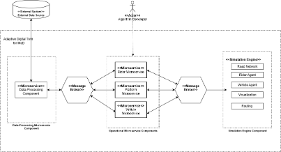
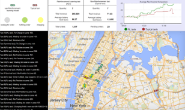

# Microservice-based Simulation Framework for Mobility-on-Demand (MoD)

## 📖 Overview

- This project presents a modular simulation framework designed for Mobility-on-Demand (MoD) applications. 
Developed with a microservice architecture, it enables clean separation of logic, flexible integration of algorithms, and real-time interaction with a simulation engine.

- The system was designed and implemented in Java with Spring Boot, leveraging event-driven communication and message queues to orchestrate complex agent behaviors in simulated urban mobility environments.

## 🛠 Technologies

- **Java + Spring Boot**: Microservice backend development
- **RabbitMQ**: Asynchronous inter-service communication
- **AnyLogic**: Agent-based simulation engine ([AnyLogic Repository](https://github.com/Matt1204/digital-twin-anyLogic))

## 🧩 System Architecture

- **Microservices**:
    - **Rider Service**: Manages rider agent lifecycles, triggers based on historical demand data
    - **Vehicle Service**: Manages vehicle agent lifecycles, providing APIs for decison-making algorithms.
    - **Platform Service**: System-wide coordination, matching logic, and metrics collection

- **Simulation Engine**:
    - Hosts agent execution using **Minimal Operational Logic Units (MOLUs)**
    - Externally controlled via RabbitMQ
    - Visualizes real-time agent movement on GIS map

## 🚀 System Demo

### Running System Screenshot

## 💡 Technical Highlights

- **Event-driven Design**: Seamless algorithm integration through Java interfaces for both simulation-driven and time-triggered events
- **Microservice Scalability**: New strategies or agent roles can be added with minimal changes to other components
- **Algorithm Plug-and-Play**: Integrated both decentralized (RL) and centralized (optimization-based) strategies
- **Simulation-Oriented APIs**: Access to real-time state and agent behaviors, with automated command publishing
  
